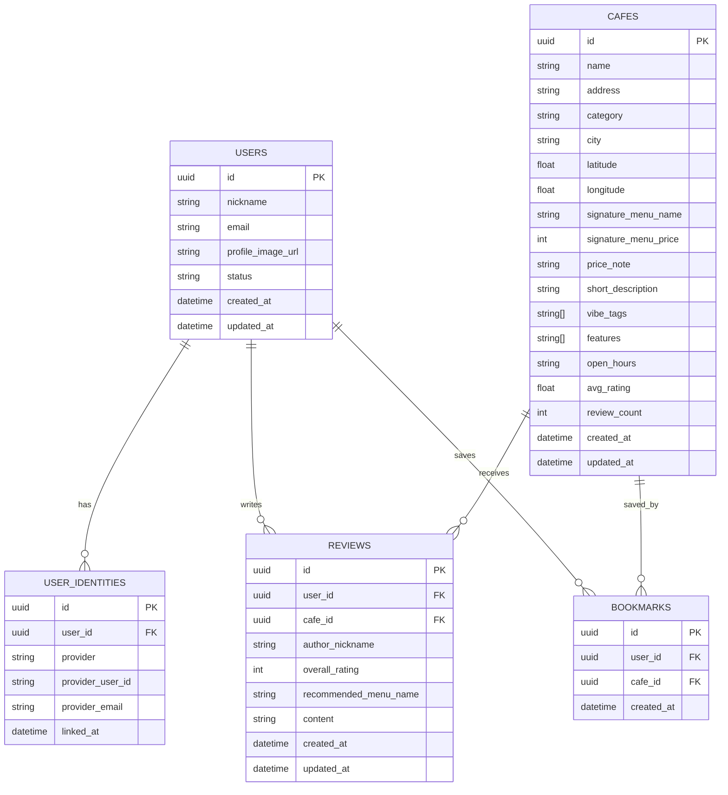

# BrewSpot ERD 기준안

최종 기준일: 2026-04-24

## 1. 목적

이 문서는 현재 BrewSpot MVP에서 실제로 쓰는 데이터 구조와, 2차 이후 확장 후보를 분리해서 정리한다.

## 2. 현재 MVP 테이블

현재 구현/스키마 기준 핵심 테이블은 아래 5개다.

1. `users`
2. `user_identities`
3. `cafes`
4. `reviews`
5. `bookmarks`

## 3. 현재 MVP ERD

## 4. 현재 MVP 테이블 설명

### users

1. 서비스 사용자 프로필 기본 테이블
2. 닉네임, 이메일, 상태, 프로필 이미지 URL 보관

### user_identities

1. 로그인 제공자 연결 정보 저장
2. 현재 provider는 `email`, `google`, `apple` 기준으로 사용
3. `provider + provider_user_id`는 unique 기준

### cafes

1. 지도와 상세 화면에 필요한 카페 정보 저장
2. 카테고리, 지역, 대표 메뉴, 가격대, 소개, 태그, 운영 시간 포함
3. `avg_rating`, `review_count`는 리뷰 기준 집계

### reviews

1. 카페 리뷰 저장
2. 현재 MVP는 `overall_rating`, `recommended_menu_name`, `content` 중심
3. 맛/분위기/가격 세부 평점과 이미지 업로드는 아직 미반영

### bookmarks

1. 사용자가 저장한 카페 관계 테이블
2. `user_id + cafe_id` unique 기준

## 5. 현재 제약 조건 기준

1. `users.nickname` unique
2. `user_identities(provider, provider_user_id)` unique
3. `bookmarks(user_id, cafe_id)` unique
4. `reviews.overall_rating`은 1~5
5. `cafes(name, address)` unique index 기준으로 upsert

## 6. 현재 문서와 스키마 연결

1. 실제 스키마 기준 문서는 `SUPABASE_MINI_SCHEMA.sql`
2. 스키마 반영 여부 확인은 `SUPABASE_VERIFY.sql`
3. 시드 기준 문서는 `CAFE_SEED_TEMPLATE.csv`, `REVIEW_SEED_TEMPLATE.csv`

## 7. 2차 이후 확장 후보

현재 구현에는 없지만 이후 확장 후보는 아래와 같다.

1. `user_preferences`
2. `cafe_menus`
3. `review_images`
4. `visit_logs`
5. `community_posts`
6. `community_comments`
7. `homebarista_posts`
8. `reports`
9. `rank_snapshots`
10. `audit_logs`
