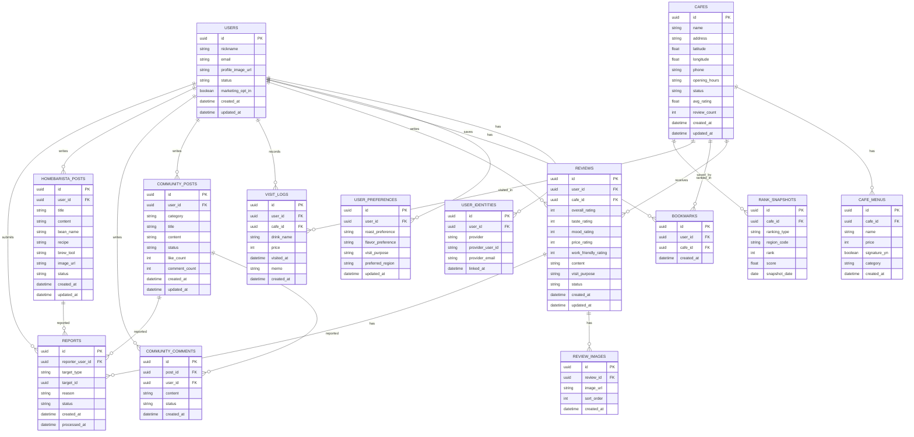

# BrewSpot ERD 초안

## 1. 목적

이 문서는 BrewSpot MVP 기준의 데이터 모델 초안이다.  
회원, 카페, 리뷰, 커뮤니티, 홈바리스타, 관리자 운영에 필요한 핵심 엔터티만 포함한다.

---

## 2. ERD 개요

---

## 3. 핵심 테이블 설명

### users

- 서비스 사용자 기본 프로필
- 닉네임, 이메일, 상태, 마케팅 동의 여부 저장

### user_identities

- SSO 연동 정보 저장
- 한 명의 사용자가 여러 로그인 제공자를 연결할 수 있게 설계
- `provider`: `apple`, `google`, `kakao`, `email`

### cafes

- 카페 기본 정보
- 지도, 상세 페이지, 추천, 랭킹의 기준 테이블

### cafe_menus

- 메뉴명, 가격, 시그니처 여부 저장

### reviews

- 카페 평가 핵심 테이블
- 종합 평점 외에 맛/분위기/가격/작업 적합도 등 구조화 점수 저장

### visit_logs

- 마이페이지의 "내가 마신 커피 기록"
- 별점 없는 개인 기록도 남길 수 있게 분리

### community_posts

- 자유게시판, 지역 추천, 질문/답변 등 커뮤니티 게시글

### homebarista_posts

- 홈바리스타 전용 게시물
- 추출 레시피, 원두, 장비 정보 저장

### reports

- 신고 대상 공통 관리
- `target_type`: `review`, `community_post`, `comment`, `homebarista_post`, `market_item`

---

## 4. 주요 인덱스 권장안

1. `user_identities(provider, provider_user_id)` unique
2. `cafes(latitude, longitude)` geo index
3. `reviews(cafe_id, created_at desc)`
4. `reviews(user_id, created_at desc)`
5. `bookmarks(user_id, created_at desc)`
6. `visit_logs(user_id, visited_at desc)`
7. `community_posts(category, created_at desc)`
8. `rank_snapshots(region_code, ranking_type, snapshot_date, rank)`

---

## 5. 제약 조건 권장안

1. `users.nickname` unique
2. `bookmarks(user_id, cafe_id)` unique
3. `user_identities(provider, provider_user_id)` unique
4. `reviews.overall_rating` 1~5 제한
5. 삭제 대신 `status` 기반 soft delete 권장

---

## 6. MVP 이후 확장 후보

1. `market_items`
2. `market_transactions`
3. `notifications`
4. `follows`
5. `cafe_owners`
6. `cafe_claim_requests`
