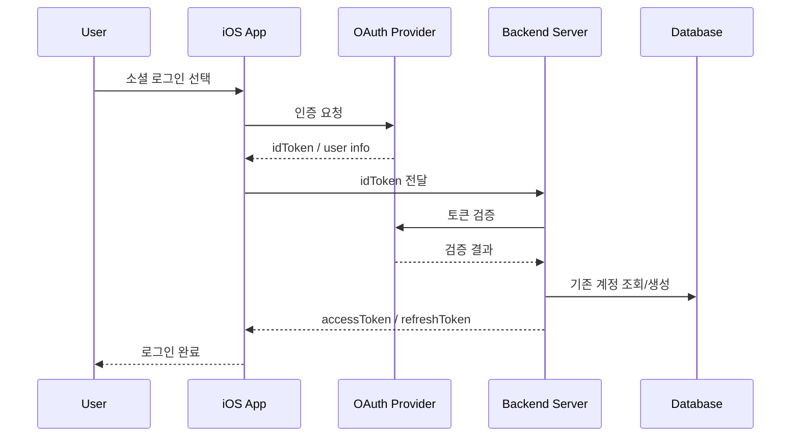

# BrewSpot 로그인/회원가입 플로우

## 1. 목적

이 문서는 BrewSpot의 로그인, 회원가입, 계정 연결, 탈퇴 흐름을 정리한다.

---

## 2. 지원 방식

1. 이메일 로그인
2. Gmail 로그인
3. Kakao 로그인
4. Naver 로그인

> [AI 추가 제안]
> 한국 사용자 기준으로는 `이메일 + Kakao + Gmail + Naver` 조합이 접근성이 좋다. 다만 iOS 앱 출시 시에는 Apple 심사 기준상 `Sign in with Apple` 제공 필요 여부를 별도로 확인해야 할 수 있다.

---

## 3. 로그인 원칙

1. 로그인은 가능한 늦게 요구한다.
2. 둘러보기는 비로그인 상태에서도 일부 허용한다.
3. 리뷰 작성, 저장, 기록 남기기, 커뮤니티 작성 시 로그인 요구
4. 최초 가입 시 최소 정보만 받는다.

---

## 4. 회원가입/로그인 플로우

### 4-1. 비로그인 사용자 진입

1. 앱 실행
2. 홈, 지도, 카페 상세는 일부 열람 가능
3. 리뷰 작성/저장/게시글 작성 시 로그인 유도

### 4-2. Gmail/Kakao/Naver 로그인

### 4-3. 소셜 로그인 공통

흐름은 동일하다.

1. 앱에서 SDK 또는 OAuth 인증
2. 제공자 토큰 수신
3. 서버로 전달
4. 서버에서 제공자 토큰 검증
5. 기존 계정 조회 또는 신규 계정 생성
6. 앱 자체 세션 토큰 발급

### 4-4. 이메일 회원가입

1. 이메일 입력
2. 비밀번호 입력
3. 닉네임 입력
4. 약관 동의
5. 이메일 인증
6. 계정 생성

### 4-5. 계정 연결

예시:

1. 사용자가 이메일 로그인으로 가입
2. 이후 Gmail 또는 Naver 로그인 추가 연동
3. 동일 계정에 `user_identities`로 provider 추가 저장

필수 정책:

1. 이미 다른 계정에 연결된 provider는 중복 연결 금지
2. 대표 로그인 수단이 하나도 남지 않으면 unlink 불가

---

## 5. 탈퇴 플로우

1. 마이페이지 > 설정 > 회원 탈퇴
2. 최근 로그인 재인증
3. 탈퇴 안내 문구 표시
4. 즉시 탈퇴 또는 법정 보관 대상 분리 보관
5. 세션 만료
6. 소셜 로그인 연결 정보 정리

---

## 6. 화면 구성 초안

### 로그인 화면

1. Kakao로 계속하기
2. Gmail로 계속하기
3. Naver로 계속하기
4. 이메일로 로그인
5. 비회원 둘러보기

### 최초 가입 완료 화면

1. 닉네임 입력
2. 프로필 이미지 선택
3. 관심 태그 선택
4. 지역 선택

### 설정 > 계정 관리

1. 연결된 로그인 방식 보기
2. Gmail/Kakao/Naver 연결
3. 연결 해제
4. 비밀번호 변경
5. 회원 탈퇴

---

## 7. 보안 체크 포인트

1. 소셜 토큰은 반드시 서버에서 검증
2. 앱이 provider_user_id를 임의로 신뢰하면 안 됨
3. Refresh Token 회전 필요
4. 탈퇴/연동 해제 시 재인증 필요
5. 관리자 계정은 일반 로그인과 분리 권장
6. 계정 연결 시 현재 로그인 사용자 확인 절차 필요

---

## 8. 개인정보 체크 포인트

1. 제공자별 식별자가 달라 이메일만으로 동일 사용자 판단 금지
2. 이메일 로그인과 소셜 로그인의 계정 연결 정책이 필요함
3. 최소 수집 원칙 적용
4. 제공자별 수집 항목을 처리방침에 명시
5. 마케팅 동의는 로그인과 분리

---

## 9. 권장 최종안

### MVP 로그인 조합

1. 이메일 로그인
2. Kakao 로그인
3. Gmail 로그인
4. Naver 로그인

### 2차 확장

1. Passkey
2. 계정 통합 UX 개선
3. Apple 심사 대응 로그인 검토
