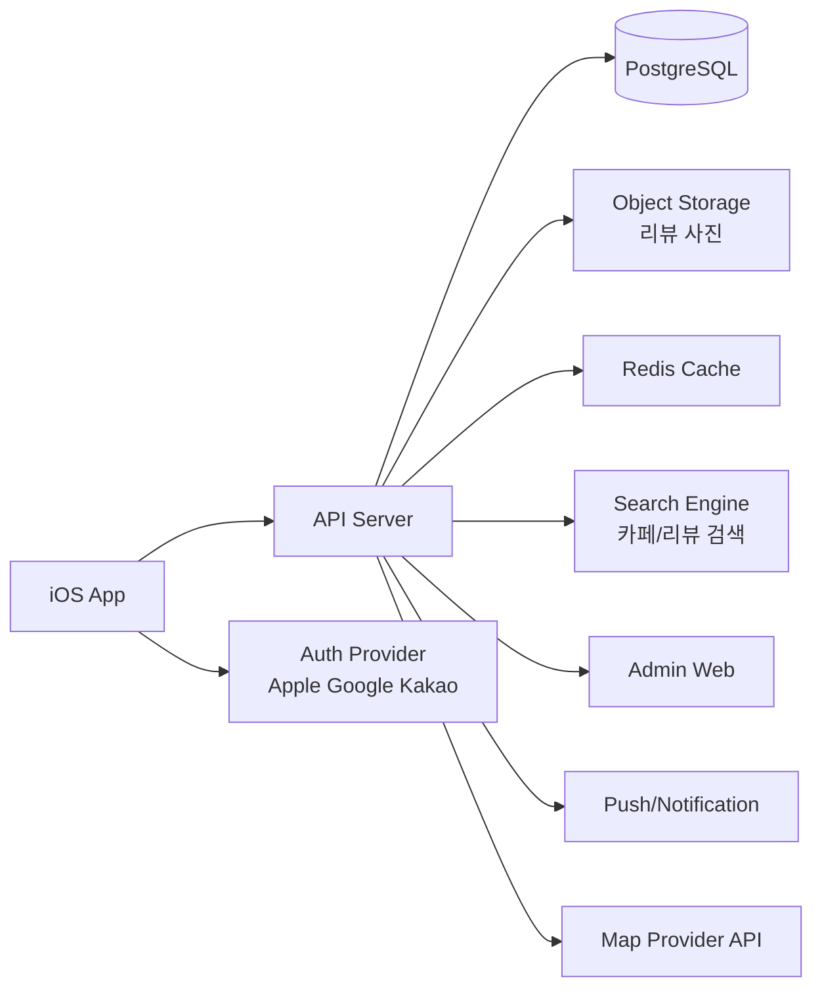

# BrewSpot PRD

## 빠른 소개

이 저장소는 `BrewSpot` iOS 커피/카페 커뮤니티 앱의 기획 문서 저장소다.

핵심 방향:

1. 지도 기반 카페 탐색
2. 커피 특화 리뷰
3. 취향 기반 추천
4. 마이페이지 기록
5. 지역 기반 커뮤니티 확장

주요 문서:

- `ONE_PAGER.md`: 대표님 보고용 1페이지 요약
- `README.md`: 정형화된 PRD 본문
- `WIREFRAME_SCREENS.md`: 화면 목록 / 와이어프레임 초안
- `ERD.md`: 데이터 모델 초안
- `API_SPEC.md`: API 명세 초안
- `LOGIN_FLOW.md`: 로그인 / 회원가입 / 계정 연결 플로우
- `SUPABASE_MINI_SCHEMA.sql`: 최소 MVP 기준 DB 초안

이 문서는 제품 방향, MVP 범위, 개발 구조, 로그인/SSO, 보안/개인정보 이슈를 빠르게 의사결정할 수 있게 정리하는 문서다.

## 0. 문서 목적

이 문서는 `iOS 커피/카페 커뮤니티 앱`의 1차 PRD 초안이다.  
목표는 제품 방향, MVP 범위, 개발 구조, 로그인/SSO, 보안/개인정보 이슈를 빠르게 의사결정할 수 있게 정리하는 것이다.

---

## 1. 제품 한 줄 정의

`내 취향에 맞는 카페를 찾고, 기록하고, 공유하는 지역 기반 커피 커뮤니티 앱`

---

## 2. 해결하려는 문제

1. 카페 정보가 지도, SNS, 블로그, 커뮤니티에 흩어져 있다.
2. 기존 지도 서비스는 장소 탐색엔 강하지만 커피 취향 중심 커뮤니티 기능은 약하다.
3. 사용자는 "평점이 높은 곳"보다 "내 취향에 맞는 곳"을 원한다.
4. 홈카페, 원두, 장비, 커피 기록, 커뮤니티가 한 흐름으로 연결되지 않는다.
5. 실제 후기, 시그니처 메뉴, 가격, 분위기, 작업 적합도 같은 정보가 구조화되어 있지 않다.

---

## 3. 타깃 사용자

### 핵심 타깃

1. 20~30대 카페 탐방 사용자
2. 리뷰 작성과 저장 행동에 익숙한 사용자
3. 홈바리스타/원두/장비 관심층

### 확장 타깃

1. 카페 운영자
2. 커피 장비 중고거래 사용자
3. 커피 트렌드 콘텐츠 소비자

> [AI 추가 제안]
> 초기 타깃은 전 연령보다 `20~30대 취향형 탐방 수요`에 맞추는 것이 더 효율적이다. aT-마켓링크 분석에서 20~30대가 카페 매출의 큰 비중을 차지한 점을 고려하면, 초기 콘텐츠와 추천 품질을 빠르게 높이기 쉽다.

---

## 4. 핵심 가치 제안

1. `지도 기반`: 근처 카페를 빠르게 탐색
2. `커피 특화 리뷰`: 커피 맛, 메뉴, 분위기, 작업 적합도 중심 평가
3. `취향 추천`: 사용자의 메뉴/분위기/방문 이력 기반 추천
4. `기록`: 내가 마신 커피와 방문 이력을 저장
5. `커뮤니티`: 지역 추천, 홈바리스타, 트렌드 공유

---

## 5. 핵심 기능

### 필수 기능

1. 지도 기능
2. 카페 상세 정보
3. 카페 평가 기능
4. 근처 카페 추천 기능
5. 요즘 뜨는 카페 추천 기능
6. 카페 랭킹 기능
7. 커뮤니티 기능
8. 홈바리스타 기능
9. 마이페이지
10. 관리자 페이지
11. 로그인 기능

### 확장 기능

1. 커피 트렌드 자동 정리
2. 커피 장비/원두 판매 페이지
3. 중고장터

---

## 6. MVP 범위

### MVP 포함

1. 이메일/Gmail/Kakao/Naver 로그인
2. 위치 기반 지도 탐색
3. 카페 상세 페이지
4. 별점/리뷰/사진 업로드
5. 저장 기능
6. 지역별/근처 추천
7. 급상승 카페
8. 카페 랭킹
9. 커뮤니티 기본 게시판
10. 홈바리스타 기본 피드
11. 마이페이지 기본 기록
12. 어드민 기본 관리

### MVP 제외

1. 커피 장비 커머스
2. 중고장터
3. 초개인화 추천 고도화
4. 자동 트렌드 요약 AI
5. 운영자 전용 상점 관리 대시보드

> [AI 추가 제안]
> MVP는 `지도 + 리뷰 + 추천 + 커뮤니티 + 로그인`에 집중하는 것이 맞다. 커머스와 중고장터는 운영/CS/정산/분쟁 비용이 커서 2차 이후가 안전하다.

---

## 7. 로그인 및 계정 정책

### 지원 로그인 방식

1. 이메일 로그인
2. Gmail 로그인
3. Kakao 로그인
4. Naver 로그인

### 권장 정책

1. 이메일, Gmail, Kakao, Naver 로그인을 지원
2. 소셜 로그인만 두지 말고 계정 연결 구조를 설계
3. 한 사용자가 Gmail/Kakao/Naver/이메일을 같은 계정으로 연결할 수 있게 설계
4. 최초 가입 시 최소 정보만 수집

### 계정 데이터 최소 수집안

1. 내부 사용자 ID
2. 로그인 제공자 식별값
3. 닉네임
4. 이메일
5. 프로필 이미지 URL
6. 약관 동의 이력
7. 마케팅 수신 동의 여부

> [AI 추가 제안]
> 전화번호, 생년월일, 실명은 MVP에서 수집하지 않는 것이 낫다. 커뮤니티/리뷰 서비스의 본질 기능에 꼭 필요하지 않기 때문이다.

---

## 8. 개발 구조

### 전체 구조

### 권장 구성

1. `iOS App`
2. `Backend API Server`
3. `DB`
4. `이미지 저장소`
5. `어드민 웹`
6. `검색 인덱스`
7. `푸시 알림`
8. `외부 지도/장소 API`
9. `로그인 SSO 연동`

---

## 9. 백엔드와 DB가 필요한가

### 결론

`필요하다.`

### 이유

이 서비스는 단순 콘텐츠 앱이 아니라 아래를 모두 처리해야 한다.

1. 사용자 계정 관리
2. 소셜 로그인/SSO 토큰 검증
3. 카페/리뷰/랭킹 데이터 저장
4. 추천 로직 실행
5. 이미지 업로드
6. 신고/제재/어드민 운영
7. 활동 로그 저장
8. 푸시 알림 발송

### 최소 백엔드 구성

1. 인증 서버 또는 인증 모듈
2. REST API 또는 GraphQL API
3. PostgreSQL
4. 이미지 스토리지
5. 관리자 어드민 백오피스

### 추천 DB 구조

1. `users`
2. `user_identities`
3. `cafes`
4. `cafe_menus`
5. `reviews`
6. `review_images`
7. `bookmarks`
8. `user_preferences`
9. `visit_logs`
10. `community_posts`
11. `community_comments`
12. `homebarista_posts`
13. `reports`
14. `rank_snapshots`
15. `audit_logs`

> [AI 추가 제안]
> MVP는 PostgreSQL 하나로 시작하고, 검색량이 많아질 때 `OpenSearch`나 `Meilisearch` 같은 검색 전용 엔진을 붙이는 방식이 비용과 복잡도를 줄인다.

---

## 10. 추천 기술 스택

### 앱

1. Swift
2. SwiftUI
3. iOS Location/MapKit 또는 외부 지도 SDK

### 백엔드

1. Node.js + NestJS 또는 Kotlin + Spring Boot
2. PostgreSQL
3. Redis
4. S3 계열 스토리지

### 관리자

1. React
2. Next.js
3. Admin dashboard 템플릿 기반 운영도 가능

### 인프라

1. AWS / GCP / Supabase / Firebase 대체형 BaaS 조합 가능
2. CDN
3. 모니터링/로그 수집

---

## 11. 추천/랭킹 로직 초안

### 근처 카페 추천 기준

1. 현재 위치와 거리
2. 사용자 취향 태그
3. 저장/방문 이력
4. 평점
5. 최근 활동성

### 요즘 뜨는 카페

1. 최근 7일 저장 수 증가
2. 최근 7일 리뷰 증가
3. 최근 7일 상세 조회 증가
4. 지역별 급상승 가중치

### 랭킹

1. 지역별 랭킹
2. 카테고리별 랭킹
3. 급상승 랭킹
4. 취향별 랭킹

---

## 12. 보안 계획

### 인증/인가

1. 서버에서 Gmail/Kakao/Naver 토큰 검증
2. 자체 세션은 `JWT + Refresh Token` 또는 세션 스토어 사용
3. Access Token 만료 시간 짧게 설정
4. Refresh Token은 회전 정책 적용
5. 관리자 계정은 일반 사용자와 분리
6. 관리자 로그인에는 2단계 인증 권장

### 데이터 보호

1. 전 구간 HTTPS
2. 민감 설정값은 Secret Manager에 저장
3. 비밀번호 로그인 사용 시 Argon2 또는 bcrypt 해시
4. DB 백업 암호화
5. 이미지 업로드 시 MIME/확장자/악성파일 검사
6. 개인정보 접근 로그 기록

### 서비스 보안

1. Rate limiting
2. Bot/스크래핑 방지
3. 리뷰/커뮤니티 스팸 탐지
4. 신고/차단/블라인드 프로세스
5. 관리자 감사 로그

### 운영 보안

1. 개발/운영 DB 분리
2. 최소 권한 원칙 적용
3. PII 접근 권한 분리
4. 보안 사고 대응 프로세스 문서화

---

## 13. 개인정보 보호 계획

### 기본 원칙

1. 목적에 필요한 최소한의 개인정보만 수집
2. 제3자 제공은 명확히 고지
3. 보유 기간 기준 명시
4. 탈퇴 시 즉시 또는 법정 보관 후 분리 보관/파기
5. 위치정보는 명확한 동의 기반 사용

### 서비스 내 수집 정보 구분

#### 필수

1. 로그인 식별자
2. 닉네임
3. 서비스 운영용 내부 ID

#### 선택

1. 프로필 이미지
2. 위치 기반 추천용 위치 정보
3. 관심 커피 취향 태그
4. 마케팅 수신 동의

#### 주의 필요

1. 정확한 위치 데이터
2. 리뷰 이미지 속 얼굴/차량번호판 등 제3자 정보
3. 소셜 로그인 연동 이메일

### 처리방침에 꼭 들어가야 할 항목

1. 수집 항목
2. 수집 목적
3. 보유 기간
4. 제3자 제공 여부
5. 처리 위탁
6. 이용자 권리 행사 방법
7. 파기 절차
8. 문의처

> [AI 추가 제안]
> 위치기반 서비스이므로 `앱 최초 실행 시 위치 권한 강제` 대신, 지도 탐색 시점에 이유를 설명하고 권한을 요청하는 방식이 UX와 동의 품질 모두에 유리하다.

---

## 14. SSO 사용 시 보안/개인정보 이슈 체크

### 결론

`SSO 자체는 가능하고 권장되지만, 서버 검증과 개인정보 최소 수집 설계가 필수다.`

### 체크 포인트

1. 클라이언트만 믿고 로그인 처리하면 안 된다.
2. Gmail/Kakao/Naver에서 받은 토큰은 서버에서 검증해야 한다.
3. 이메일 로그인은 비밀번호 보안 정책이 필요하다.
4. 제공자별 사용자 식별자가 다르므로 `identity linking` 설계가 필요하다.
5. 탈퇴/재가입 시 계정 매칭 정책이 필요하다.
6. 처리방침에 소셜 로그인 제공자와 수집 항목을 명시해야 한다.
7. 제3자 제공 또는 위탁 관계를 구분해서 고지해야 한다.

### Gmail/Kakao/Naver 로그인 관련

1. OpenID Connect/OAuth 표준 흐름 사용
2. 최소 scope만 요청
3. 프로필/이메일 외 불필요한 권한 요청 금지
4. 재동의/연결 해제 흐름 제공

### 개인정보 이슈

1. 소셜 로그인 정보는 필요한 범위만 저장해야 한다.
2. 액세스 토큰 원문 저장은 지양한다.
3. 제공자 고유 ID, 이메일, 닉네임 정도로 최소화한다.
4. 연동 해제 및 탈퇴 시 데이터 삭제/분리 보관 정책이 필요하다.

> [AI 추가 제안]
> 제품 정책을 `메일 + Kakao + Gmail + Naver`로 잡더라도, iOS 앱 출시 직전에는 App Store 심사 기준상 `Sign in with Apple` 제공 필요 여부를 반드시 다시 점검해야 한다.

---

## 15. 필요한 운영 산출물

### 제품 문서

- [ ] MVP 기능정의서
- [ ] 화면 목록
- [ ] IA 문서
- [ ] 어드민 정책 문서

### 개발 문서

- [ ] API 명세서
- [ ] DB ERD
- [ ] 인증 플로우 문서
- [ ] 권한 정책 문서
- [ ] 로그/모니터링 정책

### 보안/개인정보 문서

- [ ] 개인정보처리방침
- [ ] 이용약관
- [ ] 위치기반서비스 이용약관
- [ ] 소셜 로그인 수집 항목 정리표
- [ ] 보안 점검 체크리스트

---

## 16. 우선 내가 해야 하는 것

- [ ] MVP 범위 최종 확정
- [ ] 초기 타깃 지역 3~5곳 선정
- [ ] 로그인 방식 확정
- [ ] Apple 로그인 심사 대응 여부 확인
- [ ] 위치정보 활용 범위 확정
- [ ] 리뷰 항목 구조 확정
- [ ] 카페 데이터 수집 방식 결정
- [ ] 백엔드/DB 구축 방식 결정
- [ ] 개인정보처리방침 작성 범위 정리
- [ ] 관리자 페이지 운영 범위 확정

---

## 17. 리스크

1. 초기 카페 데이터 부족
2. 허위 리뷰와 평점 조작
3. 커뮤니티 활성화 이전 콘텐츠 부족
4. 위치정보/개인정보 이슈 대응 부족
5. SSO 계정 중복/탈퇴 정책 미비
6. 중고거래 확장 시 사기/분쟁 리스크

> [AI 추가 제안]
> 전국 확장보다 `성수`, `연남`, `망원`, `전포`, `행궁동` 같이 커피 탐방 수요가 높은 지역부터 시작하는 것이 데이터 품질과 운영 집중도 측면에서 훨씬 낫다.

---

## 18. 시장 참고

1. aT-마켓링크 분석 기반 기사에 따르면 2022년 국내 커피 소매점 매출은 약 2조 6,184억 원 규모였다.
2. 같은 분석에서 가정 내 주당 평균 커피 소비는 6.5잔으로 소개됐다.
3. 상위 5개 프랜차이즈 점유율은 59.3% 수준으로 보도됐다.
4. 당근은 2025년 연간 실적 발표와 연말결산 자료에서 로컬 커뮤니티/모임/중고거래 확장성을 보여줬다.

> [AI 추가 제안]
> 이 앱의 경쟁 상대는 단순히 네이버플레이스가 아니다. `지도 기반 장소 탐색`은 기존 서비스가 강하고, 우리 제품은 `취향 + 기록 + 커뮤니티`에 집중해야 한다.

---

## 19. 참고 자료

- Google OpenID Connect 공식 문서: https://developers.google.com/identity/openid-connect/openid-connect
- 개인정보보호위원회 개인정보 제3자 제공 안내: https://www.pipc.go.kr/np/default/page.do?mCode=H010000000
- 국가법령정보센터 개인정보보호법 관련 해석: https://www.law.go.kr/LSW/precInfoP.do?precSeq=601909
- aT 커피 시장 분석 소개: https://www.at.or.kr/article/apko362000/view.action?articleId=45505&at.condition.currentPage=405&at.condition.currentPage=79
- aT 분석 인용 기사: https://www.foodicon.co.kr/news/articleView.html?idxno=23377
- 당근 2025 연간 실적 발표: https://about.daangn.com/company/pr/archive/%EB%8B%B9%EA%B7%BC-2025%EB%85%84-%EC%97%B0%EA%B0%84-%EC%8B%A4%EC%A0%81-%EB%B0%9C%ED%91%9C/
- 당근 2025 연말결산 데이터 공개: https://about.daangn.com/company/pr/archive/%EB%8B%B9%EA%B7%BC-2025-%EC%97%B0%EB%A7%90%EA%B2%B0%EC%82%B0-%EB%8D%B0%EC%9D%B4%ED%84%B0-%EA%B3%B5%EA%B0%9C/
